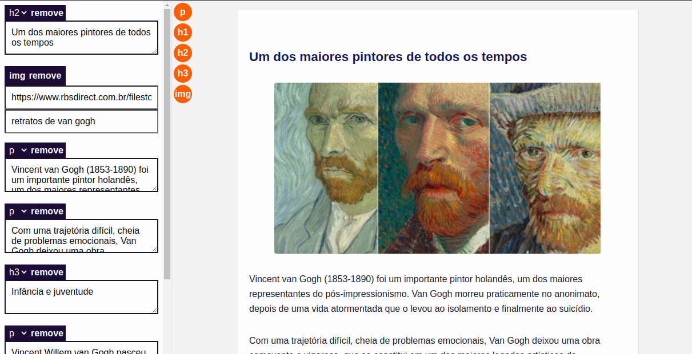

# Editor de texto

Este é um protótipo de editor de texto.

## Objetivo principal

Fornecer uma ferramenta capaz de editar um estado de texto em tempo real, fornecendo um preview do
html final.

## Como rodar?

-  clone este repositório
-  Rode o comando "npm install" no terminal
-  Abra o link informado no navegador

### Observação

Este projeto ainda está em produção
